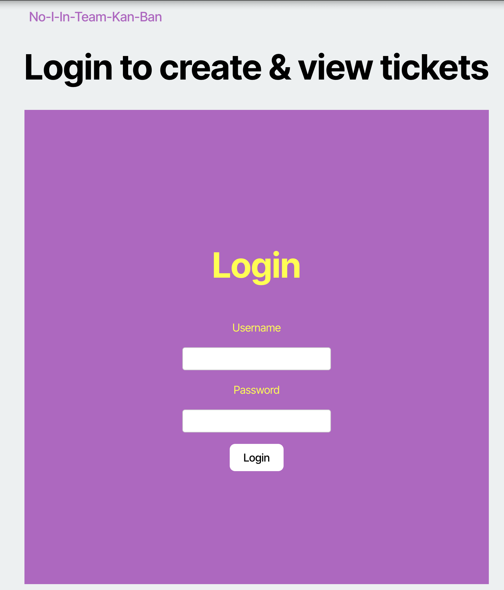
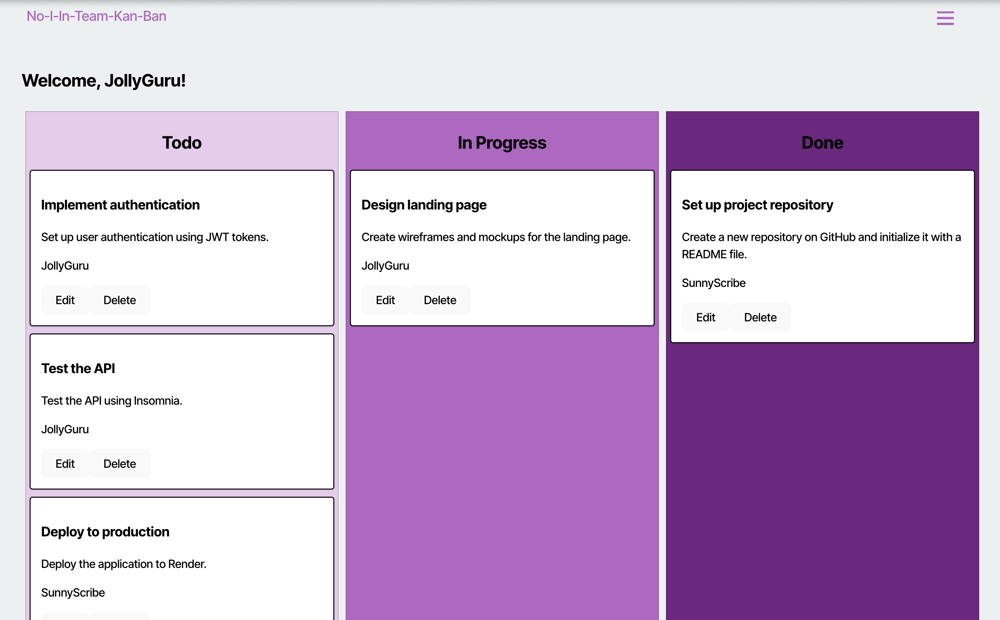
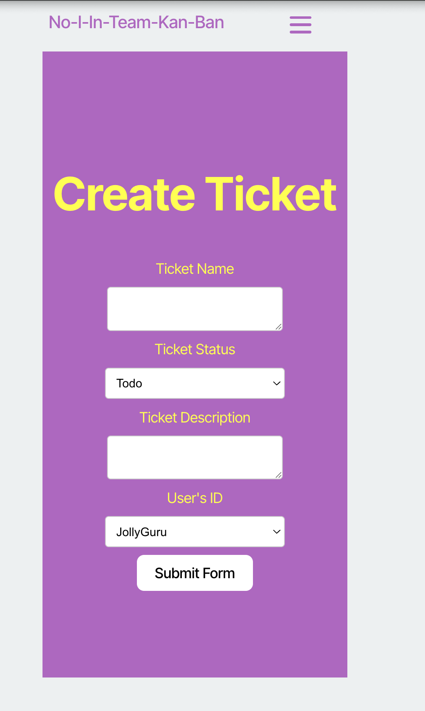

# No-I-In-Team-KanBan

A modern Kanban board application with JWT authentication for secure task management.

## Live Demo

https://no-i-in-team-kanban.onrender.com

## Interface Preview







## Testing Credentials

| Username     | Password |
| ------------ | -------- |
| JollyGuru    | password |
| SunnyScribe  | password |
| RadiantComet | password |

## Features

- **Secure Authentication**: JWT-based login system with user validation
- **Clean UI/UX**: Modern interface with hamburger menu navigation
- **Task Management**: Create, edit, and delete tickets with drag-and-drop functionality
- **User Assignment**: Assign tickets to specific team members
- **Status Tracking**: Track tickets through Todo, In Progress, and Done states
- **Responsive Design**: Works seamlessly across different screen sizes

## Technologies

- **Frontend**: React, TypeScript, CSS3
- **Backend**: Node.js, Express.js, TypeScript
- **Authentication**: JWT (JSON Web Tokens)
- **Database**: PostgreSQL
- **Deployment**: Render

## Project Structure

```
├── client/                 # Frontend React application
│   ├── src/
│   │   ├── components/     # Reusable UI components
│   │   ├── pages/         # Page components (Landing, Dashboard, etc.)
│   │   ├── api/           # API service functions
│   │   └── utils/         # Utility functions (auth, etc.)
├── server/                 # Backend Node.js application
│   ├── src/
│   │   ├── controllers/   # Request handlers
│   │   ├── models/        # Database models
│   │   ├── routes/        # API routes
│   │   └── middleware/    # Custom middleware
└── db/                     # Database schema and seeds
```

## Setup

### Prerequisites

- Node.js (v16 or higher)
- PostgreSQL database

### Installation

1. **Clone the repository**

```bash
git clone <repo-url>
cd No-I-In-Team-KanBan
```

2. **Install dependencies**

```bash
# Install server dependencies
cd server
npm install

# Install client dependencies
cd ../client
npm install
```

3. **Database setup**

```bash
# Set up your PostgreSQL database
# Update database connection in server/src/models/index.ts
```

4. **Run the application**

```bash
# Start the server (from server directory)
npm run dev

# Start the client (from client directory)
npm run dev
```

5. **Access the application**

- Frontend: http://localhost:5173
- Backend API: http://localhost:3001

## Contact

- GitHub: [joshcord99](https://github.com/joshcord99)
- Email: joshcord99@gmail.com
