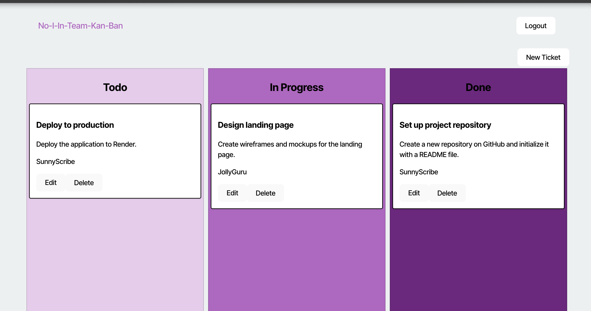

# No-I-In-Team-KanBan

A Kanban board application with JWT authentication for secure task management.

## Live Demo

https://no-i-in-team-kanban.onrender.com

## Interface Preview



## Testing Credentials

| Username     | Password |
| ------------ | -------- |
| JollyGuru    | password |
| SunnyScribe  | password |
| RadiantComet | password |

## Technologies

- Node.js
- Express.js
- TypeScript
- JWT Authentication
- PostgreSQL
- React

## Setup

```bash
git clone <repo-url>
npm install
npm run build
npm start
```

## Contact

- GitHub: [joshcord99](https://github.com/joshcord99)
- Email: joshcord99@gmail.com
